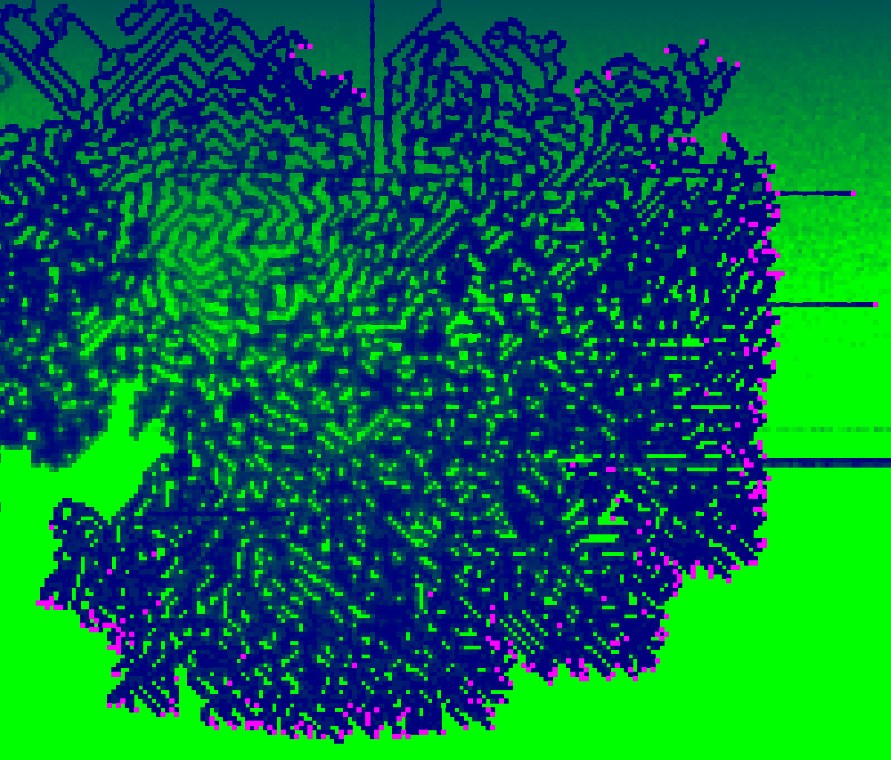
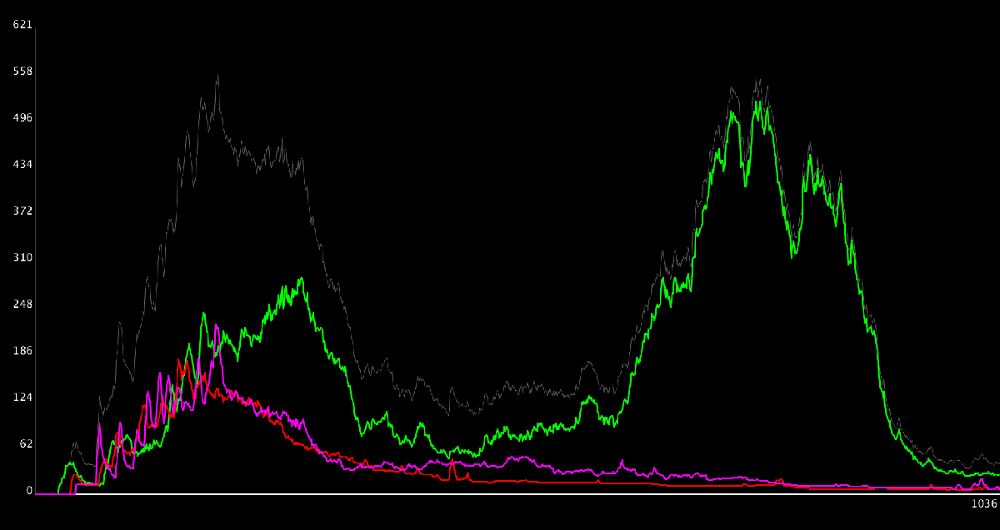

# Boot-Neurons (2019)
Don't ask me why boot.

This project is based on [Artificial life](https://www.youtube.com/watch?v=PCx228KcOow), but with differences:
1) Bots eat grass.
2) Bots are controlled by a neural network.
3) Bots cannot attack and recognize friends and enemies.

### Сontrol
space — restart  
up/down arrow — switch simulation speed  
left/right arrow — switch between tabs  
'1' — add white bots  
'2' — add blue bots  
'3' — add green bots  
'4' — add red bots  
'5' — add purple bots  

